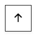
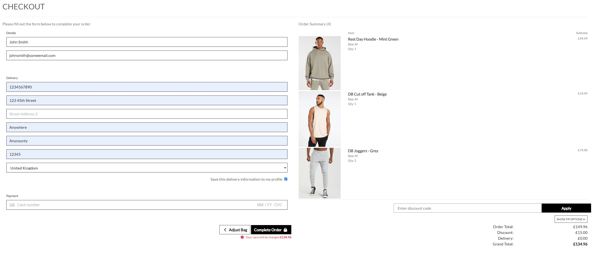
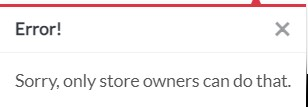

# DreamBuild Fitness

Welcome to my Project 5 for Code Institute's Full-Stack Development Program  – DreamBuild Fitness, where we combine cutting-edge technology and expert fitness solutions to create a dynamic and engaging B2C experience. Powered by a robust stack of HTML, CSS, JavaScript, Python, and Django, DreamBuild Fitness is not just a fitness website; it's a testament to the seamless integration of technology and wellness. 

As we embark on this exciting journey, let's explore how our platform leverages these technologies, including Stripe, to offer you an exceptional fitness, shopping, and community-building experience, all in one place. Stripe*, a secure and efficient payment gateway, ensures your transactions are smooth and hassle-free as you invest in your fitness journey with us.

**[Please see below on info for checking out](#stripe)*

[View the live project here.](https://dreambuildfitness-7af9d60474bd.herokuapp.com/)

---

## Table of Contents
* [User Experience (UX)](#user-experience-ux)
    * [Intended Audience](#intended-audience)
    * [User Stories](#user-stories)
* [E-Commerce Business Model](#e-commerce-business-model)
    * [Facebook Marketing](#facebook-marketing)
    * [SEO](#seo)
* [Design](#design)
    * [Wireframes & Bootstrap Templates](#wireframes--bootstrap-templates)
    * [Colour Scheme](#colour-scheme)
    * [Typograpy](#typography)
    * [Imagery](#imagery)
    * [Database Design](#database-design)
* [Features](#features)
    * [Main Header](#main-header)
    * [Navigation](#navigation)
    * [Hero Section](#hero-section)
    * [Footer](#footer)
    * [About Us](#about-us)
    * [Products Page](#products-page)
    * [Account](#account)
    * [Bag](#bag)
    * [Checkout](#checkout)
    * [Admin](#admin)
    * [Other](#other)
    * [Future Features](#future-features)
* [Technology Used](#technology-used)
    * [Languages Used](#languages-used)
    * [Django and Python Packages](#django-and-python-packages)
    * [Programs / Tools Used](#programs--tools-used)
* [Testing](#testing)
* [Bugs](#bugs)
* [Validator Testing](#validator-testing)
* [Deployment](#deployment)
* [Credits](#credits)

---

# User Experience (UX)

This website is designed to give users and future customers the ability to browse for their latest piece of gym clothing or accessory to enchance their workouts, or if they a bit more help, there is a variety of plans available! It gives the user the ability browse all categorys, or search for possible items they're looking for, set up an account, make purchases, receive confirmation emails, check previous orders and sign up for our newsletter.  

## Intended Audience

DreamBuild Fitness aims to cater to a diverse audience, offering resources and products to help people at various fitness levels and with different fitness goals.

* **Fitness Enthusiasts**: Individuals who are passionate about fitness, exercise, and maintaining a healthy lifestyle.
* **Beginners**: People who are new to fitness and seek guidance on workouts, clothing, and nutrition to kickstart their fitness journey.
* **Seasoned Athletes**: Experienced athletes looking for advanced training programs and high-quality workout apparel to elevate their performance.
* **Health-conscious Individuals**: Those focused on improving their overall well-being, including diet and exercise.
* **Shoppers**: Users interested in stylish and functional gym clothing and accessories.
* **Busy Professionals**: Individuals looking for efficient workout solutions and meal plans to fit their busy schedules.
* **Tech-Savvy Users**: Those who appreciate websites that incorporate modern web development technologies for a smooth and visually appealing user experience.

 

## User Stories

Many user stories were developed for the project using Agile development methodology, for the project see the [DreamBuild Project](https://github.com/users/DeanBurke/projects/3/views/1).

#### **Buyer**
 * [Issue #1](https://github.com/DeanBurke/DreamBuild/issues/1) I can view a list of products so that I can select some to purchase.
 * [Issue #2](https://github.com/DeanBurke/DreamBuild/issues/2) I can view a specific category of products so that I can quickly find products I'm interested in without having to search through all products.
 * [Issue #3](https://github.com/DeanBurke/DreamBuild/issues/3) I can view individual product details so that I can identify the price, description, product rating, product image and available sizes.
 * [Issue #4](https://github.com/DeanBurke/DreamBuild/issues/4) I can quickly find what plans are available so that I can decide what training or meal plan is needed.
 * [Issue #5](https://github.com/DeanBurke/DreamBuild/issues/5) I can easily view the total of my purchases at any time so that I can avoid spending too much.
 * [Issue #11](https://github.com/DeanBurke/DreamBuild/issues/11) I can sort the list of available products so that I can easily identify the best rated, best priced and categorically sorted products.
 * [Issue #12](https://github.com/DeanBurke/DreamBuild/issues/12) I can sort a specific category of product so that I can find the best-priced or best-rated product in a specific category sort the products in that category by name.
 * [Issue #13](https://github.com/DeanBurke/DreamBuild/issues/13) I can sort multiple categories of products simultaneously so that I can find the best-priced or best-rated products across broad categories, such as "clothing" or "accessories".
 * [Issue #14](https://github.com/DeanBurke/DreamBuild/issues/14) I can search for a product by name or description so that I can Find a specific product I'd like to purchaset.
 * [Issue #15](https://github.com/DeanBurke/DreamBuild/issues/15) I can easily see what I've searched for and the number of results so that I can quickly decide whether the product I want is available.
 * [Issue #16](https://github.com/DeanBurke/DreamBuild/issues/16) I can easily select the size and quantity of a product when purchasing it so that I can Ensure I don't accidently select the wrong product, quantity or size.
 * [Issue #17](https://github.com/DeanBurke/DreamBuild/issues/17) I can view items in my bag to be purchased so that I can identiy the total cost of my purchase and all items I will receive.
 * [Issue #18](https://github.com/DeanBurke/DreamBuild/issues/18) I can adjust the quantity of individual items in my bag so that I can easily make changes to my purchase before checkout.
 * [Issue #19](https://github.com/DeanBurke/DreamBuild/issues/19) I can easily enter my payment information so that I can check out quickly and with no hassles.
 * [Issue #20](https://github.com/DeanBurke/DreamBuild/issues/20) I can feel my personal and payment information is safe and secure so that I can Confidently provide the needed information to make a purhcase.
 * [Issue #21](https://github.com/DeanBurke/DreamBuild/issues/21) I can view an order confirmation after checkout so that I can Verify that I haven't made any mistakes.
 * [Issue #22](https://github.com/DeanBurke/DreamBuild/issues/22) I can receive an email confirmation after checking out so that I can keep the confirmation of what I've purchased for my records.

#### **Site User**
 * [Issue #6](https://github.com/DeanBurke/DreamBuild/issues/6) I can easily register for an account so that I can have a personal account and be able to view my profile.
 * [Issue #7](https://github.com/DeanBurke/DreamBuild/issues/7) I can easily login or logout so that I can access my personal account information.
 * [Issue #8](https://github.com/DeanBurke/DreamBuild/issues/8) I can easily recover my password in case I forget it so that I can Recover access to my account.
 * [Issue #9](https://github.com/DeanBurke/DreamBuild/issues/9) I can receive an email confirmation after registering so that I can verify that my account registration was successful.
 * [Issue #10](https://github.com/DeanBurke/DreamBuild/issues/10) I can have a personalized user profile so that I can view my personal order history and order confirmations, and save my payment information.
 * [Issue #26](https://github.com/DeanBurke/DreamBuild/issues/26) I can see if I'm on an error page so that I can see where I've gone wrong within the URL but not to be took away from the styling of the website.
 * [Issue #27](https://github.com/DeanBurke/DreamBuild/issues/27) I can view the company's about page so that I can find out a bit more and possibly contact them.

#### **Website Admin/Owner**
 * [Issue #23](https://github.com/DeanBurke/DreamBuild/issues/23) I can add a product so that I can add new items to my store.
 * [Issue #24](https://github.com/DeanBurke/DreamBuild/issues/24) I can edit/update a product so that I can change product prices, descriptions, images, and other product criteria.
 * [Issue #25](https://github.com/DeanBurke/DreamBuild/issues/25) I can delete a product so that I can Remove items that no longer for sale.

 

[Back to top &uarr;](#dreambuild-fitness)

---

# E-Commerce Business Model

DreamBuild Fitness operates on a robust B2C e-commerce business model, serving as a direct bridge between our fitness-centric offerings and our valued customers. In this model, we focus on delivering a seamless, user-friendly shopping experience for fitness enthusiasts of all levels. With a wide array of high-quality gym clothing, accessories, and health-focused resources, we bring the world of fitness to our customers' fingertips. We offer a free delivery on all orders placed that are over £50. We've used social media marketing along with email marketing to reach a wider audience - with the hope of branching out towards using the following techniques in future: 

* **Influencer Collaborations**: Partner with fitness influencers and trainers to promote the brand. Their endorsements and testimonials can have a significant impact.
* **Community Building**: Create a forum or discussion board on the website where users can interact, share their fitness journeys, and provide support to one another.
* **Loyalty Programs**: Introduce loyalty programs that reward customers for repeated purchases or referrals, encouraging brand loyalty.
* **Targeted Advertising**: Utilize online advertising platforms like Google Ads and social media ads to reach potential customers based on their interests, demographics, and online behavior.
* **Affiliate Marketing**: Establish an affiliate program where fitness bloggers and enthusiasts can earn commissions for promoting DreamBuild Fitness products.

## Facebook Marketing

A Facebook business page was created for this website, which is [linked](https://www.facebook.com/profile.php?id=61552476312298) within the footer of the website. Due to Facebook, possibly removing it, as they don't allow fake businesses to be advertised, screenshots have been took(as per below).

Facebook Media

## SEO

The website places a strong emphasis on Search Engine Optimization (SEO) to ensure that our valuable fitness resources and premium products are easily discoverable by our target audience. Our commitment to SEO involves meticulous use of meta tags, sitemap.xml, and robots.txt files. Meta tags are strategically crafted to accurately represent the content and purpose of each web page with their use in the base.html file, enhancing our visibility on search engine result pages (SERPs). 

Meanwhile, our sitemap.xml file provides search engines with a structured map of our website, ensuring that all pages are properly indexed, and updates are promptly recognized. Additionally, our robots.txt file is configured to guide search engine crawlers, allowing them to focus on indexing relevant content while respecting privacy and security settings. By employing these SEO strategies, DreamBuild Fitness ensures that fitness enthusiasts and potential customers can easily find the valuable fitness information and high-quality products they seek, reinforcing our position as a reliable and accessible online fitness resource.

[Back to top &uarr;](#dreambuild-fitness)

---

# Design

## Wireframes & Bootstrap Templates

For the site design, I took inspiration from the Boutique Ado walkthrough project along with the [Gymshark](https://uk.gymshark.com/) and [ALLSAINTS](https://www.allsaints.com/men.html) website.

Wireframes were created for the site with [Wireframe.cc](https://wireframe.cc/)

 

 

## Colour Scheme

Colour palette was created using: 

* [Colormind](http://colormind.io/)

Along with a bright vibrant blue gradient for the Hero image. 

 

## Typography

Lato was chosen from [Google Fonts](https://fonts.google.com/).

 

## Imagery

Images are located throught the website. As the header/hero image, on the about page, and as products throughout. 

Images were took from stock photo websites: 

* [Pexels](https://www.pexels.com/)
* [Freepik](https://www.freepik.com/)
* [Unsplash](https://unsplash.com/)

Along with some example of products took from various gym stores, as this is purely a fake website. (**No copyright infringement intended**):

* [MyProtein](https://www.myprotein.com/)
* [Gymshark](https://uk.gymshark.com/)
* [Pursue Fitness](https://www.pursuefitness.com/)
* [Decathalon](https://www.decathlon.co.uk/)
* [Lifthing the Dream](https://www.liftingthedream.com/)
* [Strength Shop](https://www.strengthshop.co.uk/)

Icons were used throught the website, for buttons, menu layout, challenge section, contact seciont and for social links on the footer of the website. The icons used on the site were taken from: 

* [Font Awesome](https://fontawesome.com/)
* [Bootstrap](https://icons.getbootstrap.com/)

 

## Database Design

Multiple apps and classes/models were created for the project, each one supporting the full site functionality.

* **About App** - No classes or models needed as just an about page

* **Bag App** - No classes or models needed, primarily focused on bag calculations via context.py

* **Checkout App** - Order and OrderLineItem models

    * Order Model:

    |Name           |Database Key   |Field Type     |Validation                                                                            |
    |---------------|---------------|---------------|--------------------------------------------------------------------------------------|
    |order_number   |order_number   |CharField      |max_length=32, null=False, editable=False                                             |
    |user_profile   |user_profile   |ForeignKey     |'UserProfile', on_delete=models.SET_NULL, null=True, blank=True, related_name='orders'|
    |full_name      |full_name      |CharField      |max_length=50, null=False, blank=False                                                |
    |email          |email          |EmailField     |max_length=254, null=False, blank=False                                               |
    |phone_number   |phone_number   |CharField      |max_length=20, null=False, blank=False                                                |
    |country        |country        |CountryField   |blank_label='Country *', null=False, blank=False                                      |
    |postcode       |postcode       |CharField      |max_length=20, null=True, blank=True                                                  |
    |town_or_city   |town_or_city   |CharField      |max_length=40, null=False, blank=False                                                |
    |street_address1|street_address1|CharField      |max_length=80, null=False, blank=False                                                |
    |street_address2|street_address2|CharField      |max_length=80, null=True, blank=True                                                  |
    |county         |county         |CharField      |max_length=80, null=True, blank=True                                                  |
    |date           |date           |DateTimeField  |auto_now_add=True                                                                     |
    |delivery_cost  |delivery_cost  |DecimalField   |max_digits=6, decimal_places=2, null=False, default=0                                 |
    |order_total    |order_total    |DecimalField   |max_digits=10, decimal_places=2, null=False, default=0                                |
    |grand_total    |grand_total    |DecimalField   |max_digits=10, decimal_places=2, null=False, default=0                                |
    |original_bag   |original_cart  |TextField      |null=False, blank=False, default=''                                                   |
    |stripe_pid     |stripe_pid     |CharField      |max_length=254, null=False, blank=False, default=''                                   |

     

    * OrderLineItem Model:

    |Name           |Database Key   |Field Type     |Validation                                                                          |
    |---------------|---------------|---------------|------------------------------------------------------------------------------------|
    |order          |order          |ForeignKey     |'Order', null=False, blank=False, on_delete=models.CASCADE, related_name='lineitems'|
    |product        |product        |ForeignKey     |'Product', null=False, blank=False, on_delete=models.CASCADE                        |
    |product_size   |product_size   |CharField      |max_length=2, null=True, blank=True                                                 |
    |quantity       |quantity       |IntegerField   |null=False, blank=False, default=0                                                  |
    |lineitem_total |lineitem_total |DecimalField   |max_digits=6, decimal_places=2, null=False, blank=False, editable=False             |

    
     

* **DreamBuild** - Main app

* **Home App** - No classes or models needed as it is the index page

* **Products App** - Category and Product models

    * Category Model:  

    | Name          | Database Key  | Field Type    | Validation                            |
    | ------------- | ------------- | ------------- | ------------------------------------- |
    | name          | name          | CharField     | max_length=254                        |
    | friendly_name | friendly_name | CharField     | max_length=254, null=True, blank=True |

     

    * Product Model:

    | Name        | Database Key  | Field Type        | Validation                                                   |
    | ----------- | ------------- | ----------------- | ------------------------------------------------------------ |
    | category    | category      | ForeignKey        | 'Category', null=True, blank=True, on_delete=models.SET_NULL |
    | sku         | sku           | CharField         | max_length=254, null=True, blank=True                        |
    | name        | name          | CharField         | max_length=254                                               |
    | description | description   | TextField         |                                                              |
    | has_sizes   | has_sizes     | BooleanField      | default=False, null=True, blank=True                         |
    | price       | price         | DecimalField      | max_digits=6, decimal_places=2                               |
    | rating      | rating        | DecimalField      | max_digits=6, decimal_places=2, null=True, blank=True        |
    | image       | image         | ImageField        | null=True, blank=True                                        |

     

* **Profiles App** - UserProfile model

    * UserProfile Model:  

| Name                   | Database Key            | Field Type        | Validation                                   |
| ---------------------- | ----------------------- | ----------------- | -------------------------------------------- |
| user                   | user                    | OneToOneField     | 'User', on_delete=models.CASCADE             |
| default_phone_number   | default_phone_number    | CharField         | max_length=20, null=True, blank=True         |
| default_street_address1| default_street_address1 | CharField         | max_length=80, null=True, blank=True         |
| default_street_address2| default_street_address2 | CharField         | max_length=80, null=True, blank=True         |
| default_town_or_city   | default_town_or_city    | CharField         | max_length=40, null=True, blank=True         |
| default_county         | default_county          | CharField         | max_length=80, null=True, blank=True         |
| default_postcode       | default_postcode        | CharField         | max_length=20, null=True, blank=True         |
| default_country        | default_country         | CountryField      | blank_label='Country', null=True, blank=True |

[Back to top &uarr;](#dreambuild-fitness)

---

# Features

## Main Header

* Featured at the top of the page and consistent throughout the website. Stays in place as scrolling.
* Features the brand name located to the top left, which is clickable and returns the site user to the home page.

      
    *Screenshot of main header logo*

* A functional searchbar is located centrally (will chat about functionality in the [Products Section](#products)) 

      
    *Screenshot of searchbar*

* Located in the top right is a 'My Account' icon which is a dropdown menu along with a Bag icon that shows the site user's current bag total (will chat about both functionality in the [Account Section](#account) and [Bag Section](#bag) respectively)

      
    *Screenshot of account and bag icons*

* On smaller screens the logo disappears (being replaced with the navbar functionality) and the search bar turns into a dropdown function. 

      
    *Screenshot of mobile view of the header*

* Just below the navbar there is a ticker stating the free delivery threshold.

 

## Navigation

* Featured at the top of the page and consistent throughout the website. Stays in place as scrolling.

      
    *Screenshot of navigation bar on desktop*

* Where neccessary, a dropdown menu is available to further specify a search. 

      
    *Screenshot of navigation bar dropdown on desktop*

* On smaller screens the navigation menu is hidden away, revealed when clicked the icon in the top left. Likewise the dropdown is available where neccessary.

      
    *Screenshot of navigation bar on mobile*

      
    *Screenshot of navigation bar dropdown on mobile*

 

## Hero Section 

* The Hero section contains one main Hero image, along with a Shop Now button to direct site users to the 'All Products' section and an inspirational message to site users on arrival.

      
    *Screenshot of hero section*

* When the site user hovers over the Shop Now button, it changes to a shade of grey mentioned above. 

      
    *Screenshot of hero section button*

 

## Footer

* Located at the bottom of the majority of pages throughout the website. 
* The footer is broke up into 4 sections, 3 across the top and the one section just below, following by a copyright tag. This then collapses, to being on top of one another on a mobile view. 
* First section contains the brand name along with a mission statement. 

      
    *Screenshot of footer mission statement*

* Second section is a selection of quick links for the site user to choose from to direct them to relative pages.

      
    *Screenshot of footer quick links*

* Third section contains the company's social links, with a working (currently at the time of this write up) [Facebook page](https://www.facebook.com/profile.php?id=61552476312298). The icons reverse in colour when hovered over. 

      
    *Screenshot of footer social links*

      
    *Screenshot of footer social links when hovered*

* Fourth section contains newsletter subscription service, powered by [Mailchimp](https://mailchimp.com/), where the site user enters their email details to sign up for the company's newsletter

      
    *Screenshot of footer newsletter section*

 

## About Us

* On arrival to the About Us page, a counter begins to run with the current clients total. 

* There is a brief description on brand's values and its hopes for any future clients - while also offering highend gym clothing. 

* There is also a "Join Today!" button, directing the site user to the Plans page

  
    *Gif of about us page*

 

## Products Page

* The products are split across various categories and options within the navbar to allow the site user a more effiecient experience while browsing. 

       
    *Screenshot of dropdown options*

* To add a more user friendly experience, a sort bar is located on top right (middle on smaller screens).

     
    *Screenshot of sorting dropdown*

* Also while on the "All Products", "All Clothing & "All Accessories" pages, the site user will have another option to select a category with a button at the top of the page. 

     
    *Screenshot of clothing categories*

* Also the site user can search for a product they have in mind - which will go through the name/description of the products for the relevant results. It will also return no prouducts if the search criteria doesn't have any relative results. 

     
    *Screenshot of search results*

     
    *Screenshot of search no results*

* Underneath each product image, will have the price, category and rating. 

     
    *Screenshot of product info*

* On the individual the product item pages, a further description of the product along with the option of sizes and quantity to choose from before adding it to bag, or they have choice to go back to the main products page.

     
    *Screenshot of product details*

* Where no sizes are applicable, the size option will be removed from the product item page. 

     
    *Screenshot of product details with no sizes*

* While on the product pages, there is a back to top button located in the bottom right for more user friendly experience. 

     
    *Screenshot of back to top button*

### Plans

* There are 4 plans to choose from, which vary from duration / price. The user will be contacted once payment is confirmed, then contacted regarding a start date. 

     
    *Screenshot of plans*

 

## Account

* When the site user clicks "My Account" they will have the option to Register or Login. 

     
    *Screenshot of account options*

* When a new user registers, they will have to input an email address, username and password. Before being asked to verify the email address before proceeding. 

     
    *Screenshot of account registering*

     
    *Screenshot of account verification message*

* The new user will then receive an email confirmation to finalize their registeration - and will be prompted to confirm the email address. They will then be asked to sign in again. 

     
    *Screenshot of account email confirmation*

     
    *Screenshot of account confirmation message*

* Once signed in the options will change to My Profile and Logout. 

     
    *Screenshot of account signed in*

* On the My Profile page the user will be able to save/update delivery details and see their order history. 

     
    *Screenshot of my profile*

* When the admin is logged in, they will have an aditional option available which is Product Management. Here they will be able to add new products with ease. 

     
    *Screenshot of account admin*

     
    *Screenshot of product management*

* The admin will have further options available to edit/delete products already on the website. Where if edited it will bring up the pre loaded information on the Product Management page. ***Please note, clicking delete will delete the product without a prompt**

     
    *Screenshot of account admin product view*

     
    *Screenshot of product management - edit*

 

## Bag

* When a site user adds an item to their bag, they will get a notification that the item is not sitting in their bag, along with a small summary, which also shows how much more they need to spend for free delivery. 

     
    *Screenshot of bag - delivery charge*

* On the bag page itself the shopper will be able to adjust the quantity of the item or choose to remove it. 

     
    *Screenshot of bag page - delivery charge*

* Once the value hits the the free delivery threshold, the delivery charge will be zero. 

     
    *Screenshot of bag page - free delivery*

* The shopper's bag total will stay visible throught their visit on the website in the top right.

     
    *Screenshot of bag icon*

* If the shopper removes an item from the bag, they will get a notification of this change. 

     
    *Screenshot of bag - removed item*

* On smaller screens the bag stacks for a better user experience, with the total being placed on top. A back to top button has been added for ease when making a big purchase! 

      
    *Screenshot of bag - smaller screens*

      
    *Screenshot of bag - mobile view*

 

## Checkout

* The checkout is split into two sections, the details form and an order summary of the shopper's bag. The shopper can checkout as a guest but will get a prompty if they want to create an account or login

      
    *Screenshot of checkout - guest*

* If the user is signed in, the will have an option to save their delivery information to their profile for future purchases. 

      
    *Screenshot of checkout - signed in *

* They'll get a notifaction if anything on the form isn't correctly filled out, including card details which is powered by Stripe. 

      
    *Screenshot of checkout - invalid card*

### Stripe 

* **To test the checkout please use the following card information**  

    * 4242 4242 4242 4242 (card number)
    * 04/24 (MM/YY) - *or any future date*
    * 242 or 424 (CVC) - *or any 3 digit entry*
    * 42424 (post code) - *or any 5 digit entry*

  

* Once the user clicks complete order with valid form information, a loading overlay before arriving at a checkout success page with a summary of the order and a succes message

      
    *Screenshot of checkout - loading*

      
    *Screenshot of checkout - success*

      
    *Screenshot of checkout - order summary*

* The shopper will get an email confirmation of the purchase. 

      
    *Screenshot of checkout - email confirmation*

* There will be confirmation on Stripe that the payment went through. 

      
    *Screenshot of checkout - stripe*

* The user if logged in while ordering can visit their profile and view previous orders. 

      
    *Screenshot of checkout - profile afterwards*

* On smaller screens the checkout menu is stacked. 

      
    *Screenshot of checkout - mobile*

 

## Admin

* If the admin is logged in - they will be able to directly go to the admin portal via the options on the "My Account"

     
    *Screenshot of account admin*

* Once there they will have a variety of options available to them. Can manually verify email addressesor or delete users that have been created. 

     
    *Screenshot of admin options*

* The admin can view available categories, along with edit and add new categories.

    

    
Admin - Category Section

     
    *Screenshot of admin categories*

     
    *Screenshot of admin categories - edit*

     
    *Screenshot of admin categories - add*

    

  

* The admin can view available categories, along with edit and add new categories.

    

    
Admin - Product Section

     
    *Screenshot of admin products*

     
    *Screenshot of admin products - edit*

     
    *Screenshot of admin products - add*

    

  

* Both sections have an option to go into their corresponding history, to view previous changes. 

     
    *Screenshot of admin history*

 

## Other

* Throughout the website there a custom messages to the site user of various events. To let them know of the even that has just happened. 

       
    *Screenshot of website messages*

* There is a custom Error 404 page to not take away from the user experience of the website. 

     
    *Screenshot of custom error404 page*

 

## Future Features

* A community related page where signed in users can create questions or give feedback on certain training splits etc. 

* The ability to leave comments on products and ratings

* Add Social sign-in options (Google, GitHub, Facebook)

* Discout code feature / Support an Affiliate codes

[Back to top &uarr;](#dreambuild-fitness)

---

# Technology Used

## Languages Used

* **HTML** - For adding content and formatting.
* **CSS** - For adding style and colours.
* **JavaScript** - For adding interactive features.
* **Python** - High-level, general-purpose programming language.

 

## Django and Python Packages

* **asgiref** - ASGI is a standard for Python asynchronous web apps and servers to communicate with each other, and positioned as an asynchronous successor to WSGI. 
* **boto3** - Amazon Web Services (AWS) Software Development Kit (SDK) for Python, which allows Python developers to write software that makes use of services like Amazon S3 and Amazon EC2.
* **botocore** - A low-level interface to a growing number of Amazon Web Services. 
* **dj-database-url** - This simple Django utility allows you to utilize the 12factor inspired DATABASE_URL environment variable to configure your Django application.
* **Django** - A Python-based web framework that follows the model-template-view architectural pattern, used for building the project.
* **django-allauth** - Integrated set of Django applications addressing authentication, registration, account management as well as 3rd party (social) account authentication.
* **django-countries** - A Django application that provides country choices for use with forms, flag icons static files, and a country field for models.
* **django-crispy-forms** - A Django application that makes it easy to style Django forms.
* **django-storages** - Is a project to provide a variety of storage backends in a single library.
* **gunicorn** - A Python Web Server Gateway Interface (WSGI) HTTP server.
* **jmespath** - Allows you to declaratively specify how to extract elements from a JSON document.
* **oauthlib** - Is a framework which implements the logic of OAuth1 or OAuth2 without assuming a specific HTTP request object or web framework.
* **Pillow** - A Python Imaging Library adds image processing capabilities to your Python interpreter.
* **psycopg2** - A PostgreSQL adapter for Python.
* **python3-openid** - Is a set of Python packages to support use of the OpenID decentralized identity system in your application.
* **pytz** - This library allows accurate and cross platform timezone calculations using Python 2.4 or higher.
* **requests-oauthlib** - This project provides first-class OAuth library support for Requests.
* **s3transfer** - S3transfer is a Python library for managing Amazon S3 transfers. This project is maintained and published by Amazon Web Services
* **sqlparse** - Is a non-validating SQL parser for Python. It provides support for parsing, splitting and formatting SQL statements.
* **stripe** - A Python library for the Stripe API.

 

## Programs / Tools Used

* **Amazon AWS** - Used to store the static and media files for the site.
* **Bootstrap5**- Used for adding predefined styled elements and creating responsiveness.
* **Chrome DevTools** - For debugging the project.
* **CI Python Linter** - Used for validating the python code.
* **CSS Jigsaw CSS Validator** - Used for validating the CSS.
* **ElephantSQL** - Free and open-source relational database management system (RDBMS).
* **Font Awesome** - Font Awesome use to source necessary icons used in the project.
* **GifCap** - Used to capture gif-s of the project.
* **GitHub** - Source code hosted on GitHub, deployed using Git Pages.
* **GitPod** - Used to commit, comment and push code during the development process.
* **Google Fonts** - Used to import fonts to the project.
* **Heroku**- Used to deploy the project.
* **HTML W3C HTML Validator** - Used for validating the HTML.
* **JsHint**- Used for validating the javascript code.
* **LightHouse** - Used for testing performance.
* **Mailchimp** - Used to create the newsletter signup form.
* **Stripe** has been used for the payment processing and webhooks handling.
*** Temp-Mail.org** - Used for creating temporary email addresses. 
* **Wireframe.cc** - Used to create wireframes and website structure map for the project.

[Back to top &uarr;](#dreambuild-fitness)

---

# Testing 

## Manual Testing

**Main Header**

*
*
*
*
*

**Navigation**

*
*
*
*
*

**Hero Section**

*
*
*
*
*

**Footer**

*
*
*
*
*

**About Us**

*
*
*
*
*

**Products Page**

*
*
*
*
*

**Account**

*
*
*
*
*

**Bag**

*
*
*
*
*

**Checkout**

*
*
*
*
*

**Admin**

*
*
*
*
*

 

[Back to top &uarr;](#dreambuild-fitness)

---

# Bugs  

[Back to top &uarr;](#dreambuild-fitness)

---

# Validator Testing  

* HTML
    * No errors were returned when running my final test of [W3C Validator](https://validator.w3.org/#validate_by_input)
* CSS
    * No errors were returned when running my final test of [Jigsaw Validator](https://jigsaw.w3.org/css-validator/#validate_by_input)

     
    *Screenshot of Jigsaw Validator Results*

  

* Accessibility
    * Using lighthouse in Chrome Dev Tools, I confirmed that colors and fonts were readable against backgrounds.  
     
 

* Python
    * Passed my code through the [PEP8 checker](https://pep8ci.herokuapp.com/) created by Code Institute, while also using flake8 within GitPod to remove errors.

 

[Back to top &uarr;](#dreambuild-fitness)

---