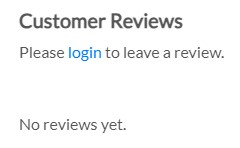
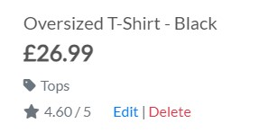
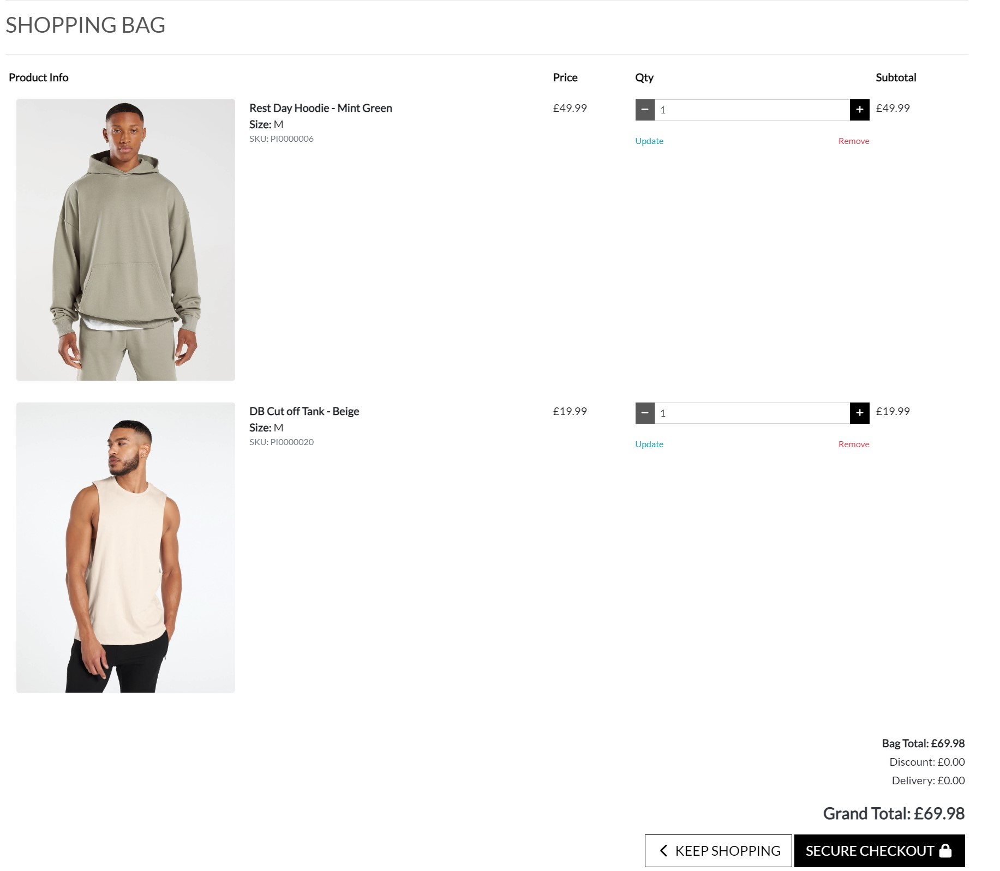

# DreamBuild Fitness

Welcome to my Project 5 for Code Institute's Full-Stack Development Program  – DreamBuild Fitness, where we combine cutting-edge technology and expert fitness solutions to create a dynamic and engaging B2C experience. Powered by a robust stack of HTML, CSS, JavaScript, Python, and Django, DreamBuild Fitness is not just a fitness website; it's a testament to the seamless integration of technology and wellness. 

As we embark on this exciting journey, let's explore how our platform leverages these technologies, including Stripe, to offer you an exceptional fitness, shopping, and community-building experience, all in one place. Stripe*, a secure and efficient payment gateway, ensures your transactions are smooth and hassle-free as you invest in your fitness journey with us.

**[Please see below on info for checking out](#stripe)*

[View the live project here.](https://dreambuildfitness-7af9d60474bd.herokuapp.com/)

---

## Table of Contents
* [User Experience (UX)](#user-experience-ux)
    * [Intended Audience](#intended-audience)
    * [User Stories](#user-stories)
* [E-Commerce Business Model](#e-commerce-business-model)
    * [Facebook Marketing](#facebook-marketing)
    * [SEO](#seo)
* [Design](#design)
    * [Wireframes & Bootstrap Templates](#wireframes--bootstrap-templates)
    * [Colour Scheme](#colour-scheme)
    * [Typograpy](#typography)
    * [Imagery](#imagery)
    * [Database Design](#database-design)
* [Features](#features)
    * [Main Header](#main-header)
    * [Navigation](#navigation)
    * [Hero Section](#hero-section)
    * [Footer](#footer)
    * [About Us](#about-us)
    * [Products Page](#products-page)
    * [Account](#account)
    * [Bag](#bag)
    * [Checkout](#checkout)
    * [Admin](#admin)
    * [Other](#other)
    * [Future Features](#future-features)
* [Technology Used](#technology-used)
    * [Languages Used](#languages-used)
    * [Django and Python Packages](#django-and-python-packages)
    * [Programs / Tools Used](#programs--tools-used)
* [Testing](#testing)
* [Bugs](#bugs)
* [Validator Testing](#validator-testing)
* [Deployment](#deployment)
* [Credits](#credits)

---

# User Experience (UX)

This website is designed to give users and future customers the ability to browse for their latest piece of gym clothing or accessory to enchance their workouts, or if they a bit more help, there is a variety of plans available! It gives the user the ability browse all categorys, or search for possible items they're looking for, set up an account, make purchases, receive confirmation emails, check previous orders and sign up for our newsletter.  

## Intended Audience

DreamBuild Fitness aims to cater to a diverse audience, offering resources and products to help people at various fitness levels and with different fitness goals.

* **Fitness Enthusiasts**: Individuals who are passionate about fitness, exercise, and maintaining a healthy lifestyle.
* **Beginners**: People who are new to fitness and seek guidance on workouts, clothing, and nutrition to kickstart their fitness journey.
* **Seasoned Athletes**: Experienced athletes looking for advanced training programs and high-quality workout apparel to elevate their performance.
* **Health-conscious Individuals**: Those focused on improving their overall well-being, including diet and exercise.
* **Shoppers**: Users interested in stylish and functional gym clothing and accessories.
* **Busy Professionals**: Individuals looking for efficient workout solutions and meal plans to fit their busy schedules.
* **Tech-Savvy Users**: Those who appreciate websites that incorporate modern web development technologies for a smooth and visually appealing user experience.

 

## User Stories

Many user stories were developed for the project using Agile development methodology, for the project see the [DreamBuild Project](https://github.com/users/DeanBurke/projects/3/views/1).

#### **Buyer**
 * [Issue #1](https://github.com/DeanBurke/DreamBuild/issues/1) I can view a list of products so that I can select some to purchase.
 * [Issue #2](https://github.com/DeanBurke/DreamBuild/issues/2) I can view a specific category of products so that I can quickly find products I'm interested in without having to search through all products.
 * [Issue #3](https://github.com/DeanBurke/DreamBuild/issues/3) I can view individual product details so that I can identify the price, description, product rating, product image and available sizes.
 * [Issue #4](https://github.com/DeanBurke/DreamBuild/issues/4) I can quickly find what plans are available so that I can decide what training or meal plan is needed.
 * [Issue #5](https://github.com/DeanBurke/DreamBuild/issues/5) I can easily view the total of my purchases at any time so that I can avoid spending too much.
 * [Issue #11](https://github.com/DeanBurke/DreamBuild/issues/11) I can sort the list of available products so that I can easily identify the best rated, best priced and categorically sorted products.
 * [Issue #12](https://github.com/DeanBurke/DreamBuild/issues/12) I can sort a specific category of product so that I can find the best-priced or best-rated product in a specific category sort the products in that category by name.
 * [Issue #13](https://github.com/DeanBurke/DreamBuild/issues/13) I can sort multiple categories of products simultaneously so that I can find the best-priced or best-rated products across broad categories, such as "clothing" or "accessories".
 * [Issue #14](https://github.com/DeanBurke/DreamBuild/issues/14) I can search for a product by name or description so that I can Find a specific product I'd like to purchaset.
 * [Issue #15](https://github.com/DeanBurke/DreamBuild/issues/15) I can easily see what I've searched for and the number of results so that I can quickly decide whether the product I want is available.
 * [Issue #16](https://github.com/DeanBurke/DreamBuild/issues/16) I can easily select the size and quantity of a product when purchasing it so that I can Ensure I don't accidently select the wrong product, quantity or size.
 * [Issue #17](https://github.com/DeanBurke/DreamBuild/issues/17) I can view items in my bag to be purchased so that I can identiy the total cost of my purchase and all items I will receive.
 * [Issue #18](https://github.com/DeanBurke/DreamBuild/issues/18) I can adjust the quantity of individual items in my bag so that I can easily make changes to my purchase before checkout.
 * [Issue #19](https://github.com/DeanBurke/DreamBuild/issues/19) I can easily enter my payment information so that I can check out quickly and with no hassles.
 * [Issue #20](https://github.com/DeanBurke/DreamBuild/issues/20) I can feel my personal and payment information is safe and secure so that I can Confidently provide the needed information to make a purhcase.
 * [Issue #21](https://github.com/DeanBurke/DreamBuild/issues/21) I can view an order confirmation after checkout so that I can Verify that I haven't made any mistakes.
 * [Issue #22](https://github.com/DeanBurke/DreamBuild/issues/22) I can receive an email confirmation after checking out so that I can keep the confirmation of what I've purchased for my records.
 * [Issue #28](https://github.com/DeanBurke/DreamBuild/issues/28) I can spend over a certain amount so that I can receive a discount on my total spend.
 * [Issue #29](https://github.com/DeanBurke/DreamBuild/issues/29) I can enter a valid discount code so that I can receive an additional discount to my purchase due to an ongoing campaign that is running.
 * [Issue #30](https://github.com/DeanBurke/DreamBuild/issues/30) I can leave a review so that I can give feedback to the company on a recent purchase.
 * [Issue #31](https://github.com/DeanBurke/DreamBuild/issues/31) I can leave a tip with my purchase so that I can support a charity/cause that DreamBuild supports.

#### **Site User**
 * [Issue #6](https://github.com/DeanBurke/DreamBuild/issues/6) I can easily register for an account so that I can have a personal account and be able to view my profile.
 * [Issue #7](https://github.com/DeanBurke/DreamBuild/issues/7) I can easily login or logout so that I can access my personal account information.
 * [Issue #8](https://github.com/DeanBurke/DreamBuild/issues/8) I can easily recover my password in case I forget it so that I can Recover access to my account.
 * [Issue #9](https://github.com/DeanBurke/DreamBuild/issues/9) I can receive an email confirmation after registering so that I can verify that my account registration was successful.
 * [Issue #10](https://github.com/DeanBurke/DreamBuild/issues/10) I can have a personalized user profile so that I can view my personal order history and order confirmations, and save my payment information.
 * [Issue #26](https://github.com/DeanBurke/DreamBuild/issues/26) I can see if I'm on an error page so that I can see where I've gone wrong within the URL but not to be took away from the styling of the website.
 * [Issue #27](https://github.com/DeanBurke/DreamBuild/issues/27) I can view the company's about page so that I can find out a bit more and possibly contact them.

#### **Website Admin/Owner**
 * [Issue #23](https://github.com/DeanBurke/DreamBuild/issues/23) I can add a product so that I can add new items to my store.
 * [Issue #24](https://github.com/DeanBurke/DreamBuild/issues/24) I can edit/update a product so that I can change product prices, descriptions, images, and other product criteria.
 * [Issue #25](https://github.com/DeanBurke/DreamBuild/issues/25) I can delete a product so that I can Remove items that no longer for sale.

 

[Link to Project Board](https://github.com/users/DeanBurke/projects/3)

[Back to top &uarr;](#dreambuild-fitness)

---

# E-Commerce Business Model

DreamBuild Fitness operates on a robust B2C e-commerce business model, serving as a direct bridge between our fitness-centric offerings and our valued customers. In this model, we focus on delivering a seamless, user-friendly shopping experience for fitness enthusiasts of all levels. With a wide array of high-quality gym clothing, accessories, and health-focused resources, we bring the world of fitness to our customers' fingertips. We offer a free delivery on all orders placed that are over £50. We've used social media marketing along with email marketing to reach a wider audience - with the hope of branching out towards using the following techniques in future: 

* **Influencer Collaborations**: Partner with fitness influencers and trainers to promote the brand. Their endorsements and testimonials can have a significant impact.
* **Community Building**: Create a forum or discussion board on the website where users can interact, share their fitness journeys, and provide support to one another.
* **Loyalty Programs**: Introduce loyalty programs that reward customers for repeated purchases or referrals, encouraging brand loyalty.
* **Targeted Advertising**: Utilize online advertising platforms like Google Ads and social media ads to reach potential customers based on their interests, demographics, and online behavior.
* **Affiliate Marketing**: Establish an affiliate program where fitness bloggers and enthusiasts can earn commissions for promoting DreamBuild Fitness products.

## Facebook Marketing

A Facebook business page was created for this website, which is [linked](https://www.facebook.com/profile.php?id=61552476312298) within the footer of the website. Due to Facebook, possibly removing it, as they don't allow fake businesses to be advertised, screenshots have been took(as per below).

Facebook Media

## SEO

The website places a strong emphasis on Search Engine Optimization (SEO) to ensure that our valuable fitness resources and premium products are easily discoverable by our target audience. Our commitment to SEO involves meticulous use of meta tags, sitemap.xml, and robots.txt files. Meta tags are strategically crafted to accurately represent the content and purpose of each web page with their use in the base.html file, enhancing our visibility on search engine result pages (SERPs). 

Meanwhile, our sitemap.xml file provides search engines with a structured map of our website, ensuring that all pages are properly indexed, and updates are promptly recognized. Additionally, our robots.txt file is configured to guide search engine crawlers, allowing them to focus on indexing relevant content while respecting privacy and security settings. By employing these SEO strategies, DreamBuild Fitness ensures that fitness enthusiasts and potential customers can easily find the valuable fitness information and high-quality products they seek, reinforcing our position as a reliable and accessible online fitness resource.

[Back to top &uarr;](#dreambuild-fitness)

---

# Design

## Wireframes & Bootstrap Templates

For the site design, I took inspiration from the Boutique Ado walkthrough project along with the [Gymshark](https://uk.gymshark.com/) and [ALLSAINTS](https://www.allsaints.com/men.html) website.

Wireframes were created for the site with [Wireframe.cc](https://wireframe.cc/)

 

 

## Colour Scheme

Colour palette was created using: 

* [Colormind](http://colormind.io/)

Along with a bright vibrant blue gradient for the Hero image. 

 

## Typography

Lato was chosen from [Google Fonts](https://fonts.google.com/).

 

## Imagery

Images are located throught the website. As the header/hero image, on the about page, and as products throughout. 

Images were took from stock photo websites: 

* [Pexels](https://www.pexels.com/)
* [Freepik](https://www.freepik.com/)
* [Unsplash](https://unsplash.com/)

Along with some example of products took from various gym stores, as this is purely a fake website. (**No copyright infringement intended**):

* [MyProtein](https://www.myprotein.com/)
* [Gymshark](https://uk.gymshark.com/)
* [Pursue Fitness](https://www.pursuefitness.com/)
* [Decathalon](https://www.decathlon.co.uk/)
* [Lifthing the Dream](https://www.liftingthedream.com/)
* [Strength Shop](https://www.strengthshop.co.uk/)

Icons were used throught the website, for buttons, menu layout, challenge section, contact seciont and for social links on the footer of the website. The icons used on the site were taken from: 

* [Font Awesome](https://fontawesome.com/)
* [Bootstrap](https://icons.getbootstrap.com/)

 

## Database Design

Multiple apps and classes/models were created for the project, each one supporting the full site functionality.

* **About App** - No classes or models needed as just an about page

* **Bag App** - No classes or models needed, primarily focused on bag calculations via context.py

* **Checkout App** - Order and OrderLineItem models

    * Order Model:

    |Name           |Database Key   |Field Type     |Validation                                                                            |
    |---------------|---------------|---------------|--------------------------------------------------------------------------------------|
    |order_number   |order_number   |CharField      |max_length=32, null=False, editable=False                                             |
    |user_profile   |user_profile   |ForeignKey     |'UserProfile', on_delete=models.SET_NULL, null=True, blank=True, related_name='orders'|
    |full_name      |full_name      |CharField      |max_length=50, null=False, blank=False                                                |
    |email          |email          |EmailField     |max_length=254, null=False, blank=False                                               |
    |phone_number   |phone_number   |CharField      |max_length=20, null=False, blank=False                                                |
    |country        |country        |CountryField   |blank_label='Country *', null=False, blank=False                                      |
    |postcode       |postcode       |CharField      |max_length=20, null=True, blank=True                                                  |
    |town_or_city   |town_or_city   |CharField      |max_length=40, null=False, blank=False                                                |
    |street_address1|street_address1|CharField      |max_length=80, null=False, blank=False                                                |
    |street_address2|street_address2|CharField      |max_length=80, null=True, blank=True                                                  |
    |county         |county         |CharField      |max_length=80, null=True, blank=True                                                  |
    |date           |date           |DateTimeField  |auto_now_add=True                                                                     |
    |delivery_cost  |delivery_cost  |DecimalField   |max_digits=6, decimal_places=2, null=False, default=0                                 |
    |discount_code  |discount_code  |ForeignKey     |'DiscountCode', on_delete=models.SET_NULL, null=True, blank=True                      |
    |discount_spend |discount_spend |DecimalField   |max_digits=6, decimal_places=2, null=False, default=0                                 |
    |tip_amount     |tip_amount     |DecimalField   |max_digits=6, decimal_places=2, null=False, default=0                                 |
    |order_total    |order_total    |DecimalField   |max_digits=10, decimal_places=2, null=False, default=0                                |
    |grand_total    |grand_total    |DecimalField   |max_digits=10, decimal_places=2, null=False, default=0                                |
    |original_bag   |original_cart  |TextField      |null=False, blank=False, default=''                                                   |
    |stripe_pid     |stripe_pid     |CharField      |max_length=254, null=False, blank=False, default=''                                   |

     

    * OrderLineItem Model:

    |Name           |Database Key   |Field Type     |Validation                                                                          |
    |---------------|---------------|---------------|------------------------------------------------------------------------------------|
    |order          |order          |ForeignKey     |'Order', null=False, blank=False, on_delete=models.CASCADE, related_name='lineitems'|
    |product        |product        |ForeignKey     |'Product', null=False, blank=False, on_delete=models.CASCADE                        |
    |product_size   |product_size   |CharField      |max_length=2, null=True, blank=True                                                 |
    |quantity       |quantity       |IntegerField   |null=False, blank=False, default=0                                                  |
    |lineitem_total |lineitem_total |DecimalField   |max_digits=6, decimal_places=2, null=False, blank=False, editable=False             |

    
     

* **DreamBuild** - Main app

* **Home App** - No classes or models needed as it is the index page

* **Products App** - Category and Product models

    * Category Model:  

    | Name          | Database Key  | Field Type    | Validation                            |
    | ------------- | ------------- | ------------- | ------------------------------------- |
    | name          | name          | CharField     | max_length=254                        |
    | friendly_name | friendly_name | CharField     | max_length=254, null=True, blank=True |

     

    * Product Model:

    | Name        | Database Key  | Field Type        | Validation                                                   |
    | ----------- | ------------- | ----------------- | ------------------------------------------------------------ |
    | category    | category      | ForeignKey        | 'Category', null=True, blank=True, on_delete=models.SET_NULL |
    | sku         | sku           | CharField         | max_length=254, null=True, blank=True                        |
    | name        | name          | CharField         | max_length=254                                               |
    | description | description   | TextField         |                                                              |
    | has_sizes   | has_sizes     | BooleanField      | default=False, null=True, blank=True                         |
    | price       | price         | DecimalField      | max_digits=6, decimal_places=2                               |
    | rating      | rating        | DecimalField      | max_digits=6, decimal_places=2, null=True, blank=True        |
    | image       | image         | ImageField        | null=True, blank=True                                        |

     

* **Profiles App** - UserProfile model

    * UserProfile Model:  

| Name                   | Database Key            | Field Type        | Validation                                   |
| ---------------------- | ----------------------- | ----------------- | -------------------------------------------- |
| user                   | user                    | OneToOneField     | 'User', on_delete=models.CASCADE             |
| default_phone_number   | default_phone_number    | CharField         | max_length=20, null=True, blank=True         |
| default_street_address1| default_street_address1 | CharField         | max_length=80, null=True, blank=True         |
| default_street_address2| default_street_address2 | CharField         | max_length=80, null=True, blank=True         |
| default_town_or_city   | default_town_or_city    | CharField         | max_length=40, null=True, blank=True         |
| default_county         | default_county          | CharField         | max_length=80, null=True, blank=True         |
| default_postcode       | default_postcode        | CharField         | max_length=20, null=True, blank=True         |
| default_country        | default_country         | CountryField      | blank_label='Country', null=True, blank=True |

[Back to top &uarr;](#dreambuild-fitness)

---

# Features

## Main Header

* Featured at the top of the page and consistent throughout the website. Stays in place as scrolling.
* Features the brand name located to the top left, which is clickable and returns the site user to the home page.

      
    *Screenshot of main header logo*

* A functional searchbar is located centrally (will chat about functionality in the [Products Section](#products)) 

      
    *Screenshot of searchbar*

* Located in the top right is a 'My Account' icon which is a dropdown menu along with a Bag icon that shows the site user's current bag total (will chat about both functionality in the [Account Section](#account) and [Bag Section](#bag) respectively)

      
    *Screenshot of account and bag icons*

* On smaller screens the logo disappears (being replaced with the navbar functionality) and the search bar turns into a dropdown function. 

      
    *Screenshot of mobile view of the header*

* Just below the navbar there is a ticker stating the free delivery threshold.

 

## Navigation

* Featured at the top of the page and consistent throughout the website. Stays in place as scrolling.

      
    *Screenshot of navigation bar on desktop*

* Where neccessary, a dropdown menu is available to further specify a search. 

      
    *Screenshot of navigation bar dropdown on desktop*

* On smaller screens the navigation menu is hidden away, revealed when clicked the icon in the top left. Likewise the dropdown is available where neccessary.

      
    *Screenshot of navigation bar on mobile*

      
    *Screenshot of navigation bar dropdown on mobile*

 

## Hero Section 

* The Hero section contains one main Hero image, along with a Shop Now button to direct site users to the 'All Products' section and an inspirational message to site users on arrival.

      
    *Screenshot of hero section*

* When the site user hovers over the Shop Now button, it changes to a shade of grey mentioned above. 

      
    *Screenshot of hero section button*

 

## Footer

* Located at the bottom of the majority of pages throughout the website. 
* The footer is broke up into 4 sections, 3 across the top and the one section just below, following by a copyright tag. This then collapses, to being on top of one another on a mobile view. 
* First section contains the brand name along with a mission statement. 

      
    *Screenshot of footer mission statement*

* Second section is a selection of quick links for the site user to choose from to direct them to relative pages.

      
    *Screenshot of footer quick links*

* Third section contains the company's social links, with a working (currently at the time of this write up) [Facebook page](https://www.facebook.com/profile.php?id=61552476312298). The icons reverse in colour when hovered over. 

      
    *Screenshot of footer social links*

      
    *Screenshot of footer social links when hovered*

* Fourth section contains newsletter subscription service, powered by [Mailchimp](https://mailchimp.com/), where the site user enters their email details to sign up for the company's newsletter

      
    *Screenshot of footer newsletter section*

 

## About Us

* On arrival to the About Us page, a counter begins to run with the current clients total. 

* There is a brief description on brand's values and its hopes for any future clients - while also offering highend gym clothing.

* There is paragraph stating the brand's charity endeavours, and a link that will take you to the charity that is supported. 

  
    *Gif of about us page*

* There is also a "Join Today!" button, directing the site user to the Plans page

  
    *Gif of about us page*

 

## Products Page

* The products are split across various categories and options within the navbar to allow the site user a more effiecient experience while browsing. 

       
    *Screenshot of dropdown options*

* To add a more user friendly experience, a sort bar is located on top right (middle on smaller screens).

     
    *Screenshot of sorting dropdown*

* Also while on the "All Products", "All Clothing & "All Accessories" pages, the site user will have another option to select a category with a button at the top of the page. 

     
    *Screenshot of clothing categories*

* Also the site user can search for a product they have in mind - which will go through the name/description of the products for the relevant results. It will also return no prouducts if the search criteria doesn't have any relative results. 

     
    *Screenshot of search results*

     
    *Screenshot of search no results*

* Underneath each product image, will have the price, category and rating. 

     
    *Screenshot of product info*

* On the individual the product item pages, a further description of the product along with the option of sizes and quantity to choose from before adding it to bag, or they have choice to go back to the main products page.

     
    *Screenshot of product details*

* Where no sizes are applicable, the size option will be removed from the product item page. 

     
    *Screenshot of product details with no sizes*

* While on the product pages, there is a back to top button located in the bottom right for more user friendly experience. 

     
    *Screenshot of back to top button*

* There is an option for users to leave a review on products, once they are logged in.

      
    *Screenshot of back to product reviews*
    
* Once logged in the user can leave a 1 to 5 rating along with a comment on the product.

     
    *Screenshot of back to product reviews form*

* When the user clicks submit, all reviews will be listed out. 

     
    *Screenshot of back to product reviews form*

### Plans

* There are 4 plans to choose from, which vary from duration / price. The user will be contacted once payment is confirmed, then contacted regarding a start date. 

     
    *Screenshot of plans*

 

## Account

* When the site user clicks "My Account" they will have the option to Register or Login. 

     
    *Screenshot of account options*

* When a new user registers, they will have to input an email address, username and password. Before being asked to verify the email address before proceeding. 

     
    *Screenshot of account registering*

     
    *Screenshot of account verification message*

* The new user will then receive an email confirmation to finalize their registeration - and will be prompted to confirm the email address. They will then be asked to sign in again. 

     
    *Screenshot of account email confirmation*

     
    *Screenshot of account confirmation message*

* Once signed in the options will change to My Profile and Logout. 

     
    *Screenshot of account signed in*

* On the My Profile page the user will be able to save/update delivery details and see their order history. 

     
    *Screenshot of my profile*

* When the admin is logged in, they will have an aditional option available which is Product Management. Here they will be able to add new products with ease. 

     
    *Screenshot of account admin*

     
    *Screenshot of product management*

* The admin will have further options available to edit/delete products already on the website. Where if edited it will bring up the pre loaded information on the Product Management page. ***Please note, clicking delete will delete the product without a prompt**

     
    *Screenshot of account admin product view*

     
    *Screenshot of product management - edit*

 

## Bag

* When a site user adds an item to their bag, they will get a notification that the item is not sitting in their bag, along with a small summary, which also shows how much more they need to spend for free delivery. 

     
    *Screenshot of bag - delivery charge*

* On the bag page itself the shopper will be able to adjust the quantity of the item or choose to remove it. 

     
    *Screenshot of bag page - delivery charge*

* Once the value hits the the free delivery threshold, the delivery charge will be zero. 

     
    *Screenshot of bag page - free delivery*

* The shopper's bag total will stay visible throught their visit on the website in the top right.

     
    *Screenshot of bag icon*

* If the shopper removes an item from the bag, they will get a notification of this change. 

     
    *Screenshot of bag - removed item*

* If the shopper spends over £120, as shown on the ticker at the top of the page. 

     
    *Screenshot of discount spend info*

* They will get 10% off their order total.

     
    *Screenshot of bag - discount spend *

* On smaller screens the bag stacks for a better user experience, with the total being placed on top. A back to top button has been added for ease when making a big purchase! 

      
    *Screenshot of bag - smaller screens*

      
    *Screenshot of bag - mobile view*

 

## Checkout

* The checkout is split into two sections, the details form and an order summary of the shopper's bag. The shopper can checkout as a guest but will get a prompty if they want to create an account or login

      
    *Screenshot of checkout - guest*

* If the user is signed in, the will have an option to save their delivery information to their profile for future purchases. 

      
    *Screenshot of checkout - signed in *

* They'll get a notifaction if anything on the form isn't correctly filled out, including card details which is powered by Stripe. 

      
    *Screenshot of checkout - invalid card*

* There is also a discount code feature on the on the checkout page for any ongoing campaigns. Along with a tip feature for the user to donate towards DreamBuild's sponsored charity. 

      
    *Screenshot of checkout - discount code and tip*

* If the user enters a valid code (**XMAS20**) they'll get a success message and the discount code will be viewable, and also be able to delete it. 

      
    *Screenshot of checkout - valid discount code*

* The user will get an error message if they enter an incorrect code. 

      
    *Screenshot of checkout - invalid discount code*

* For the tip feature there is four options from a dropdown menu, with no tip being set to default. When no tip is selected it isn't visible on the totals line. 

      
    *Screenshot of checkout - tip options*

* When a tip is applied, the user will get a success message. and tip will be visible on the totals line. 

      
      
    *Screenshot of checkout - tip applied successfully*

### Stripe 

* **To test the checkout please use the following card information**  

    * 4242 4242 4242 4242 (card number)
    * 04/24 (MM/YY) - *or any future date*
    * 242 or 424 (CVC) - *or any 3 digit entry*
    * 42424 (post code) - *or any 5 digit entry*

  

* Once the user clicks complete order with valid form information, a loading overlay before arriving at a checkout success page with a summary of the order and a succes message

      
    *Screenshot of checkout - loading*

      
    *Screenshot of checkout - success*

      
    *Screenshot of checkout - order summary*

* The shopper will get an email confirmation of the purchase. 

      
    *Screenshot of checkout - email confirmation*

* There will be confirmation on Stripe that the payment went through. 

      
    *Screenshot of checkout - stripe*

* The user if logged in while ordering can visit their profile and view previous orders. 

      
    *Screenshot of checkout - profile afterwards*

* On smaller screens the checkout menu is stacked. 

      
    *Screenshot of checkout - mobile*

 

## Admin

* If the admin is logged in - they will be able to directly go to the admin portal via the options on the "My Account"

     
    *Screenshot of account admin*

* Once there they will have a variety of options available to them. Can manually verify email addressesor or delete users that have been created. 

     
    *Screenshot of admin options*

* The admin can view available categories, along with edit and add new categories.

    

    
Admin - Category Section

     
    *Screenshot of admin categories*

     
    *Screenshot of admin categories - edit*

     
    *Screenshot of admin categories - add*

    

  

* The admin can view available categories, along with edit and add new categories.

    

    
Admin - Product Section

     
    *Screenshot of admin products*

     
    *Screenshot of admin products - edit*

     
    *Screenshot of admin products - add*

    

  

* Both sections have an option to go into their corresponding history, to view previous changes. 

     
    *Screenshot of admin history*

 

## Other

* Throughout the website there a custom messages to the site user of various events. To let them know of the even that has just happened. 

       
    *Screenshot of website messages*

* There is a custom Error 404 page to not take away from the user experience of the website. 

     
    *Screenshot of custom error404 page*

 

## Future Features

* A community related page where signed in users can create questions or give feedback on certain training splits etc. 

* Add Social sign-in options (Google, GitHub, Facebook)

* Sale feature, where admin can quickly set sales on products under certain categories and give the sale an expiry date. 

* Split the payments going to Stripe, so tips go separate, which will make it easier for the company to make the donation. 

[Back to top &uarr;](#dreambuild-fitness)

---

# Technology Used

## Languages Used

* **HTML** - For adding content and formatting.
* **CSS** - For adding style and colours.
* **JavaScript** - For adding interactive features.
* **Python** - High-level, general-purpose programming language.

 

## Django and Python Packages

* **asgiref** - ASGI is a standard for Python asynchronous web apps and servers to communicate with each other, and positioned as an asynchronous successor to WSGI. 
* **boto3** - Amazon Web Services (AWS) Software Development Kit (SDK) for Python, which allows Python developers to write software that makes use of services like Amazon S3 and Amazon EC2.
* **botocore** - A low-level interface to a growing number of Amazon Web Services. 
* **dj-database-url** - This simple Django utility allows you to utilize the 12factor inspired DATABASE_URL environment variable to configure your Django application.
* **Django** - A Python-based web framework that follows the model-template-view architectural pattern, used for building the project.
* **django-allauth** - Integrated set of Django applications addressing authentication, registration, account management as well as 3rd party (social) account authentication.
* **django-countries** - A Django application that provides country choices for use with forms, flag icons static files, and a country field for models.
* **django-crispy-forms** - A Django application that makes it easy to style Django forms.
* **django-storages** - Is a project to provide a variety of storage backends in a single library.
* **gunicorn** - A Python Web Server Gateway Interface (WSGI) HTTP server.
* **jmespath** - Allows you to declaratively specify how to extract elements from a JSON document.
* **oauthlib** - Is a framework which implements the logic of OAuth1 or OAuth2 without assuming a specific HTTP request object or web framework.
* **Pillow** - A Python Imaging Library adds image processing capabilities to your Python interpreter.
* **psycopg2** - A PostgreSQL adapter for Python.
* **python3-openid** - Is a set of Python packages to support use of the OpenID decentralized identity system in your application.
* **pytz** - This library allows accurate and cross platform timezone calculations using Python 2.4 or higher.
* **requests-oauthlib** - This project provides first-class OAuth library support for Requests.
* **s3transfer** - S3transfer is a Python library for managing Amazon S3 transfers. This project is maintained and published by Amazon Web Services
* **sqlparse** - Is a non-validating SQL parser for Python. It provides support for parsing, splitting and formatting SQL statements.
* **stripe** - A Python library for the Stripe API.

 

## Programs / Tools Used

* **Amazon AWS** - Used to store the static and media files for the site.
* **Bootstrap5**- Used for adding predefined styled elements and creating responsiveness.
* **Chrome DevTools** - For debugging the project.
* **CI Python Linter** - Used for validating the python code.
* **CSS Jigsaw CSS Validator** - Used for validating the CSS.
* **ElephantSQL** - Free and open-source relational database management system (RDBMS).
* **Font Awesome** - Font Awesome use to source necessary icons used in the project.
* **GifCap** - Used to capture gif-s of the project.
* **GitHub** - Source code hosted on GitHub, deployed using Git Pages.
* **GitPod** - Used to commit, comment and push code during the development process.
* **Google Fonts** - Used to import fonts to the project.
* **Heroku**- Used to deploy the project.
* **HTML W3C HTML Validator** - Used for validating the HTML.
* **JsHint**- Used for validating the javascript code.
* **LightHouse** - Used for testing performance.
* **Mailchimp** - Used to create the newsletter signup form.
* **Stripe** has been used for the payment processing and webhooks handling.
*** Temp-Mail.org** - Used for creating temporary email addresses. 
* **Wireframe.cc** - Used to create wireframes and website structure map for the project.

[Back to top &uarr;](#dreambuild-fitness)

---

# Testing 

## Manual Testing

**Main Header**

* Tested to make sure header stays in place when scrolling, right across the website.
* Tested to make sure Logo, is clickable and brings the user back to the home page. 
* Tested to make sure the searchbar functionality works, and gives the user relevant results, or none if applicable.
* Tested to make sure all of the above is functional on smaller screens, and collapses down where neccessary. 

**Navigation**

* Tested to make all dropdown choices work smoothly 
* Tested to make sure all links flow through to their respective pages. 
* Tested to make sure navigation bar collapes on smaller screens with the dropdown functionality still working.

**Hero Section**

* Tested to make sure the 'SHOP NOW' button directs the site user to the All Products section
* Tested to make sure the background image stays the main focus on all screen sizes*

**Footer**

* Tested to make sure the footer is at the bottom of all pages that it is featured on.
* Tested to make sure all quick links bring you to the correct page. 
* Tested to make sure all social links open on a new tab.
* Tested to make sure the facebook link brings the user to the company's business page.
* Tested to make sure Mailchimp's newsletter functionality works. 
* Tested to make sure the footer stacks on smaller screens. 

**About Us**

* Tested to make sure client counter loads correctly on page load up.
* Tested to make sure the link to [Mental Health Foundation](https://www.mentalhealth.org.uk/) options up on a new page once clicked. 
* Tested to make sure the 'Join Today!' button directs the user to the Plans page. 
* Tested to make sure the page stacks correctly on smaller screens.

**Products Page**

* Tested to make sure the 'Sort by' functionality works on all pages. 
* Tested to make sure the additional category buttons while on the "All Products", "All Clothing & "All Accessories" pages, all work correctly. 
* Tested to make sure the edit/delete buttons are visible only when logged in as a Superuser / Admin. When edit is clicked it'll pre load the Product Management page with the products information before updating. 
* Tested to make sure the size option is only visible on products where it is needed. 
* Tested to make sure the products stack to a suitable amount depending on screen size. 
* Tested to make sure the customer review asks you to login before being able to leave a review.
* Tested to make sure the form is visisble and usable once logged in. 
* Tested to make sure the reviews stack on top of each other once submitted. 
* Tested to make sure the Back To Top button works correctly. 

**Account**

* Tested to make sure the 'My Account' dropdown options are available regardless on the page the user is on. 
* Tested to make sure the user needs to input correct/sufficient information while setting up an account, or they'll be prompted with their error. 
* Tested to make sure the user gets an email confirmation link sent, and works correctly to verify their email address. 
* Tested to make sure the options change once the user is logged in, and they are different from a standard member to a Superuser / Admin. 
* Tested to make sure the My Profile page works as it should and can update the user's delivery information, and the can view prior orders.
* Tested to make sure the Product Management option works and brings the Admin, to the relavant page and the form works correctly. 
* Tested to make sure the Admin Portal directs the Admin straight to the correct page. 

**Bag**

* Tested to make sure the Bag total is available and accurate regardless on the page the user is on.
* Tested to make sure when an item it is added it shows a summary with a success message.
* Tested to make sure the update and remove buttons and functionality work correctly. 
* Tested to make sure the delivery charge logic works correctly depending on how much(£) is in the bag. 
* Tested to make sure the discount spend logic works correctly depending on how much(£) is in the bag. 
* Tested to make sure the bag page stacks correctly on smaller screens. 

**Checkout**

* Tested to make sure the information submitted needs to be in the correct format. 
* Tested to make sure the option to login, and thus save the user's delivery details as an option works correctly. 
* Tested to make sure the loading overlay initiates once the 'Complete Order' button is pressed and the user is directed to a success page with an order confirmation and an email sent to the inbox. 
* Tested to make sure payment is received on Stripe via webhooks, and are successful. 
* Tested to make sure the discount code submits valid codes, and gives an error if not. 
* Tested to make sure the active discount code is visible and is able to be removed. 
* Tested to make sure the tip options is default set to no tip, and the tip total won't show if so. 
* Tested to make sure the dropdown functionality works fine, and tips can be applied successfully. 
* Tested to make sure the discount and tip totals update correctly depending on what is applied. 
* Tested to make sure the checkout page stacks correctly on smaller screens. 

**Admin**

* Tested to make sure the Admin can create, edit or delete Orders/Categories/Products/Users 
* Tested to make sure the history of any edit is visible. 
*

**Other**

* Tested to make sure Toast messages are working correctly depending on the event that has happened. 
* Tested to make sure that any page that isn't on the website, but manually typed into the URL, results in the custom 404 page being shown.

 

[Back to top &uarr;](#dreambuild-fitness)

---

# Bugs  

## Resolved Bugs

* **Background Image**

    * When initially styling the background image, I wanted to make sure it was a focal point on all screen sizes. 
    * I had set the background position using a pixel format, eg  
    `background-position: -400px 500px;`    
    * As it went down the the screen size, I adjusted accordingly. Which worked fine when I was looking through Google Chrome's Dev Tools on the responsive view and slowing making the screen smaller.
    * However when the website was deployed and checked through the screen sizes, the background image became not visible. 
    * To fix this I switched to a % format, which seemed to work smoothly. Eg 
    `background-position: 70% 40%;`  

* **Product images**

    * As some of these images varied in sizes, this resulted in different heights being shown on the corresponding product, clothing and accessories pages. I initially did a fix within CSS, but this had a knock on issue on the product details page. 
    * To get around this I used the following code found from [StackOverflow](https://stackoverflow.com/): 
    `.card-img-top {
    width: 100%;
    height: 15vw;
    object-fit: cover;
    }`
    * Which was a brilliant fix as it enabled zoom to prevent any image stretching. 

* **Mailchimp Newsletter CSS**

    * I was having issues initially styling without taking away from any of the core components, I was trying different classes etc but it was getting overrided. 
    * Annoyingly it was a quick fix in the end to resolve this, by just using the classes that were being took from Mailchimp's core css, and using: 
     `!important`

* **Discounts / Tip**

    * When I got the functionality of all the discount logic, that was being applied to the bag. It was correctly showing in the browser, and the grand total was being updated to the correct amount. 
    * However, upon succesfully checking out, I noticed it was duplicating orders and the incorrect total was being sent to Stripe.
    * This was due to me not updating the checkout view and the "update_total" function within the order model. Once this was done, successful orders were put through, and they matched the total being sent to Stripe also.

* **Migrations**

    * When updating the order model, while testing the discount logic, which was some trial and error. It seemed to want me to make migration for something that was migrated a few hours prior and was working fine. 
    * From searching for solutions through Slack and Google, and chatting to the Tutor team at [Code Institute](https://codeinstitute.net/), I had to reset my ElephantSQL database. 
    * Had to set up fixtures and a few other areas again, but it all worked fine. 

## Unresolved Bugs 

* No known bugs present in the project at the time of writing this readme/testing.

  

[Back to top &uarr;](#dreambuild-fitness)

---

# Validator Testing  

* HTML
    * No errors were returned when running my final test of [W3C Validator](https://validator.w3.org/#validate_by_input)

     
    *Screenshot of W3C Validator Results*

* CSS
    * No errors were returned when running my final test of [Jigsaw Validator](https://jigsaw.w3.org/css-validator/#validate_by_input)

     
    *Screenshot of Jigsaw Validator Results*

  

* Accessibility
    * Using lighthouse in Chrome Dev Tools, I confirmed that colors and fonts were readable against backgrounds.  

     
    *Screenshot of Lighthouse Results*
     
 

* Python
    * Passed my code through the [PEP8 checker](https://pep8ci.herokuapp.com/) created by Code Institute, while also using **flake8** within GitPod to remove errors.

 

[Back to top &uarr;](#dreambuild-fitness)

---

# Deployment

### **Create an External Database**

* Log in to [ElephantSQL.com](https://www.elephantsql.com/) to access your dashboard

* Click “Create New Instance”

* Set up your plan
    * Give your plan a Name
    * Select the Tiny Turtle (Free) plan
    * You can leave the Tags field blank

* Select “Select Region” and select nearest data center

* Then click “Review” and check your details are correct and then click “Create instance”

 

### **Create an Heroku App**

* Click New to create a new app, give your app a name and select the region closest to you. When you’re done, click Create app to confirm

* Open the Settings tab and add the config var DATABASE_URL, and for the value, copy in your database url from ElephantSQL.

 

### **Connecting DB to Local Environment**

* In the terminal, install dj_database_url and psycopg2 and freeze requirements.txt file
    * `pip3 install dj_database_url==0.5.0 psycopg2`
    * `pip3 freeze > requirements.txt`

* In your settings.py file, import dj_database_url underneath the import for os

        import os
        import dj_database_url

* In the DATABASES section of settings, update it to the following. 

        # DATABASES = {
        #     'default': {
        #         'ENGINE': 'django.db.backends.sqlite3',
        #         'NAME': os.path.join(BASE_DIR, 'db.sqlite3'),
        #     }
        # }
            
        DATABASES = {
            'default': dj_database_url.parse('your-database-url-here')
        }

* In the terminal, run the showmigrations command to confirm you are connected to the external database
    * `python3 manage.py showmigrations`

* If the database is connected correctly, there will be a list of migrations that are unchecked. Run migrations to migrate the models to the new database:
    * `python3 manage.py migrate`

* Load in the fixtures (if applicable), categories first then products.
    * `python3 manage.py loaddata categories`
    * `python3 manage.py loaddata products`

* Create a superuser for your new database
    * `python3 manage.py createsuperuser`

* Add an if/else statement for the databases in settings.py, so the development database will be used while in development - and the external database on the live site:

        if 'DATABASE_URL' in os.environ:
            DATABASES = {
            'default': dj_database_url.parse(os.environ.get('DATABASE_URL'))
            }
        else:
            DATABASES = {
                'default': {
                    'ENGINE': 'django.db.backends.sqlite3',
                    'NAME': os.path.join(BASE_DIR, 'db.sqlite3')
                }
            }
 

### **Deploying to Heroku**

* Install gunicorn and freeze into requirements.txt
    * `pip3 install gunicorn`
    * `pip3 freeze > requirements.txt`

* Create a Procfile in the root directory for Heroku to read:
        
        web: gunicorn dreambuild.wsgi:application

* If needed, install Heroku
    * `npm install -g heroku`
    * `heroku login -i`

* Temporarily disable collectstatic by logging into the Heroku CLI in the terminal (`heroku login -i`) or on Heroku.com and set DISABLE_COLLECTSTATIC to 1:
    * `heroku config:set DISABLE_COLLECTSTATIC=1 --app heroku-app-name`

* Add the hostname of the Heroku app to allowed hosts in settings.py:

        ALLOWED_HOSTS = ['heroku-deployed-site-url', 'localhost/GITPOD workspace']

* Save the settings.py file, and add and commit the changes:
    * `git push Heroku main`

* To enable automatic deploys on Heroku, go to the app in Heroku. On the deploy tab, connect to GitHub. Search for the repository and then click connect. Then click Enable Automatic Deploys.

 

### **Generate SECRET_KEY**

* Django creates a Secret Key for each project upon creation.

* We can create a new one with the link below.

* Go to [miniwebtool's](https://miniwebtool.com/django-secret-key-generator/) Django Secret Key Generator, click on the Generate Django Secret Key button and copy the value.

* In Heroku, add a new Config Var SECRET_KEY and give it the value of the newly generated secret key and then click add.

* In the settings.py file add:

        SECRET_KEY = os.environ.get('SECRET_KEY', '')

* Change the DEBUG

        DEBUG = 'DEVELOPMENT' in os.environ

* Save the settings.py file, add, commit and then git push these changes.

 

### **AWS (S3 bucket setup)**

*Sign in or create an account on AWS(l add link to AWS)*

**Create a new S3 bucket:**

* Navigate and Click "Services" search option in the top left-hand corner of the landing page, and search for "S3."

* Navigate and Click "Create bucket."

* Give the bucket a unique name (ideally match the Heroku app name)

* Select the nearest location

* Under the "Object Ownership" section, select "ACLS enabled"

* Under the "Block Public Access settings for this bucket" section, untick "Block all public access" and tick the box to acknowledge that this will make the bucket public.

* Navigate and Click "Create bucket."

 

**Edit Bucket settings**

* Bucket Properties: 

    * Navigate and Click on the bucket name to open the bucket.

    * Navigate and Click on the "Properties" tab.

    * Under the "Static website hosting" section, click "Edit".

    * Under the "Static website hosting" section select "Enable".

    * Under the "Hosting type" section ensure "Host a static website" is selected.

    * Under the "Index document" section enter "index.html".

    * Under the "Error document" section enter "error.html".

    * Navigate and Click "Save changes."

 

* Bucket Permissions: -

    * Navigate and Click on the "Permissions" tab.

    * Scroll down to the "CORS configuration" section and click edit.

    Enter the following snippet into the text box:

        [
            {
                "AllowedHeaders": [
                "Authorization"
                ],
                "AllowedMethods": [
                "GET"
                ],
                "AllowedOrigins": [
                "*"
                ],
                "ExposeHeaders": []
            }
        ]

    * Navigate and Click "Save changes."

    * Scroll back up to the "Bucket Policy" section and click "Edit."

    * In the newly opened tab under Step 1 "Select Policy Type" select "S3 Bucket Policy." from the drop down menu.

    * Under Step 2 enter " * " in the "Principal" text box.

    * From the "s3:Action" drop down menu select "s3:GetObject".

    * Enter the "ARN" noted from the bucket policy page into the "Amazon  Resource Name (ARN)" text box.

    * Navigate and Click "Add Statement."

    * Under Step 3 "Generate Policy" click "Generate Policy."

    * Copy the resultant policy and paste it into the bucket policy text box on the previous tab.

    * In the same text box add "/*" to the end of the resource key to allow access to all resources in this bucket.

    * Navigate and Click "Save changes."

    * When back on the buckets permissions tab, scroll down to the "Access Control List" section and click "Edit." Enable "List" for "Everyone (public access)", tick the box to accept that "I understand the effects of these changes on my objects and buckets." and click "Save changes."

 

**Create AWS static files User and assign to S3 Bucket:**

* Create "User Group": 

    * Navigate to the "Services" search in the top left-hand corner of the landing page, seach for "IAM".

    * Under "Access management" click "User Groups."

    * Navigate and Click "Create Group."

    * Enter a user name .

    * Scroll to the bottom of the page and click "Create Group."

 

* Create permissions policy for the new user group: 

    * Navigate and Click "Policies" in the left-hand menu.

    * Navigate and Click "Create Policy."

    * Navigate and Click "Import managed policy."

    * Search for "AmazonS3FullAccess", select this policy, and click "Import".

    * Navigate and Click "JSON" under "Policy Document" to see the imported policy

    * Copy the bucket ARN from the bucket policy page and paste it into the "Resource" section of the JSON snippet. Be sure to remove the default value of the resource key ("*") and replace it with the bucket ARN.

    * Copy the bucket ARN a second time into the "Resource" section of the JSON snippet. This time, add "/*" to the end of the ARN to allow access to all resources in this bucket.

    * Navigate and Click "Next: Tags".

    * Navigate and Click "Next: Review".

    * Navigate and Click "Review Policy".

    * Enter a name for the policy.

    * Enter a description for the policy.

    * Navigate and Click "Create Policy".

 

* Attach Policy to User Group: 

    * Navigate and Click "User Groups" in the left-hand menu.

    * Navigate and Click on the user group name created during the above step.

    * Select the "Permissions" tab. 

    * Click "Attach Policies".

    * Search for the policy created during the above step, and select it.

    * Navigate and Click "Attach Policy."

* Create User: 

    * Navigate and Click "Users" in the left-hand menu.

    * Navigate and Click "Add user".

    * Enter a "User name".

    * Select "Programmatic access" and "AWS Management Console access".

    * Navigate and Click "Next: Permissions".

    * Select "Add user to group".

    * Select the user group created during the above step.

    * Navigate and Click "Next: Tags".

    * Navigate and Click "Next: Review".

    * Navigate and Click "Create user".

* Please follow the steps below to get the CSV file.

    * Go to IAM and select 'Users'.

    * Select the user for whom you wish to create a CSV file.

    * Select the 'Security Credentials' tab.

    * Scroll to 'Access Keys' and click 'Create access key'.

    * Select 'Application running outside AWS', and click next.

    * On the next screen, you can leave the 'Description tag value' blank. Click 'Create Access Key'.

    * Click the 'Download .csv file' button.

 

### **Connecting Django to AWS S3**

* Connecting Heroku to AWS S3

    * `pip3 install boto3`
    * `pip3 install django-storages`
    * `pip3 freeze > requirements.txt`

* Add storages to the installed apps in settings.py

* Add the bucket configuration:

       if 'USE_AWS' in os.environ:
        AWS_S3_OBJECT_PARAMETERS = {
            'Expires': 'Thu, 31 Dec 2099 20:00:00 GMT',
            'CacheControl': 'max-age=9460800',
        }

        AWS_STORAGE_BUCKET_NAME = 'your-bucket-name'
        AWS_S3_REGION_NAME = 'your-selected-region'
        AWS_ACCESS_KEY_ID = os.environ.get('AWS_ACCESS_KEY_ID')
        AWS_SECRET_ACCESS_KEY = os.environ.get('AWS_SECRET_ACCESS_KEY')
        AWS_S3_CUSTOM_DOMAIN = f'{AWS_STORAGE_BUCKET_NAME}.s3.amazonaws.com'

* Add the Secret Keys from the downloaded CSV file to Heroku: 

        | AWS_ACCESS_KEY_ID     | CSV info |
        | AWS_SECRET_ACCESS_KEY | CSV info |
        | USE_AWS               | True     |

* Remove COLLECTSTATIC variable from the Config Vars.

* Create custom_storages.py file and add:    

        from django.conf import settings
        from storages.backends.s3boto3 import S3Boto3Storage

        class StaticStorage(S3Boto3Storage):
            location = settings.STATICFILES_LOCATION

        class MediaStorage(S3Boto3Storage):
            location = settings.MEDIAFILES_LOCATION

* In settings.py, set the static locations as follows:

        # Static and media files
        STATICFILES_STORAGE = 'custom_storages.StaticStorage'
        STATICFILES_LOCATION = 'static'
        DEFAULT_FILE_STORAGE = 'custom_storages.MediaStorage'
        MEDIAFILES_LOCATION = 'media'

        # Override static and media URLs in production
        STATIC_URL = f'https://{AWS_S3_CUSTOM_DOMAIN}/{STATICFILES_LOCATION}/'
        MEDIA_URL = f'https://{AWS_S3_CUSTOM_DOMAIN}/{MEDIAFILES_LOCATION}/'

* Add a cache control to the AWS settings in settings.py:

        # Cache control
        AWS_S3_OBJECT_PARAMETERS = {
            'Expires': 'Thu, 31 Dec 2099 20:00:00 GMT',
            'CacheControl': 'max-age=94608000',
        }

* Git add . and git push to save these changes.

* Go to s3 and create a new folder called media then click upload. Add the product images files, click next and under manage public permissions, select grant public read access to these objects. Then click next through to the end and finally, click upload.

  

### **Stripe Setting Up**

 * We now need to add our Stripe keys to our config vars in Heroku to keep these out of our code and keep them private. Log into Stripe, click developers and then API keys.

 * Create 2 new variables in Heroku's config vars - for the publishable key (STRIPE_PUBLIC_KEY) and the secret key (STRIPE_SECRET_KEY) and paste the values in from the Stripe page.

 * Now we need to add the WebHook endpoint for the deployed site. Navigate to the WebHooks link in the left hand menu and click add endpoint button. Add the URL for our deployed sites WebHook, give it a description and then click the add events button and select all events. Click Create endpoint.

 * Now we can add the WebHook signing secret to our Heroku config variables as STRIPE_WH_SECRET.

 * In settings.py:

        STRIPE_PUBLIC_KEY = os.getenv('STRIPE_PUBLIC_KEY', '')
        STRIPE_SECRET_KEY = os.getenv('STRIPE_SECRET_KEY', '')
        STRIPE_WH_SECRET = os.getenv('STRIPE_WH_SECRET', '')

  

[Back to top &uarr;](#dreambuild-fitness)

---

# Credits

* I used a lot of code learned from various projects throughtout the PP4 stage and the PP5 Stage.

    * Bootstrap Resume

    * Flask walkthrough project

    * I Think Therefore I Blog

    * Hello Django

    * Boutique Ado

* I used the [Bootstrap](https://getbootstrap.com/docs/4.0/getting-started/introduction/) documentation pages throughout this project, which were extremely helpful for styling. 

* Slack was used throughout the project, as small issues arose. Previous students having similar queries really assited me as the solution was talked through my other helpful members of [Code Institute](https://codeinstitute.net/). The tutor team was also an incredible help throughout!

* [StackOverflow](https://stackoverflow.com/) was also of great assistance throughout. The amount of detailed information was incredible to have, a few particular issues that were solved through [StackOverflow](https://stackoverflow.com/) were the following:
    * Setting cards all same height and width without stretching the image was resolved with this [article](https://stackoverflow.com/questions/37287153/how-to-get-images-in-bootstraps-card-to-be-the-same-height-width).
    * Setting up the initial discount code logic, this [article](https://stackoverflow.com/questions/65678232/how-to-redeem-coupon-code-which-i-created-in-django) put me on the right track

* [Codepen.io](https://codepen.io/), in particular some work by [Lewis Carey](https://codepen.io/lewismcarey) helped with the CSS for the 'Free Delivery' ticker used throughout the website.
    * This [pen](https://codepen.io/lewismcarey/pen/GJZVoG) in particular. 

* [CSS Tricks](https://css-tricks.com/) was also a great website, and this [article](https://css-tricks.com/animating-number-counters/) put me on the right track for my client count on the [About Page](#about-us). 

* Also [W3Schools](https://www.w3schools.com/) was helpful with regards to my issues on the [background position](https://www.w3schools.com/cssref/pr_background-position.php).

 

[Back to top &uarr;](#dreambuild-fitness)

---